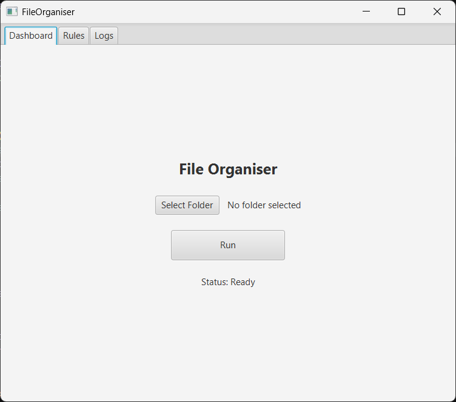
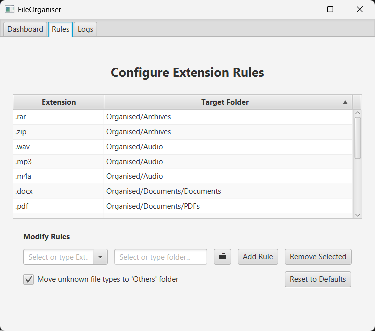
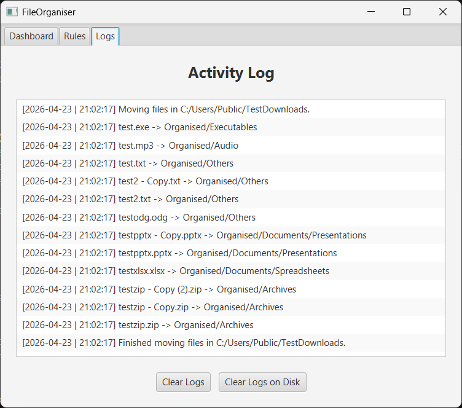

# FileOrganiser (JavaFX)

A simple desktop automation tool that automatically organises files in a folder (like Downloads) based on file type.

Built using JavaFX as a learning project for file automation and UI development.

---

## Features

- Automatically sorts files into folders (Documents, Images, Archives, etc.)
- Uses file extensions to determine categories
- Customisable sorting rules
- Saves user preferences locally
- Keeps a log of moved files
- Toggle option for unknown file types (“Others” folder)
- Reset settings to default

---

## Tech Stack

- Java 21+
- JavaFX 21
- Maven
- Java NIO (file handling)

---

## Screenshot







---

## What I Learned

- JavaFX UI development
- File handling with Java NIO
- MVC-style separation of logic and UI
- Persistent storage using system AppData directories

---

## How to Run

### Prerequisites
- Java 21 or higher
- Maven installed

### Steps

```bash
git clone https://github.com/your-username/FileOrganiser.git
cd FileOrganiser
mvn clean install
mvn javafx:run